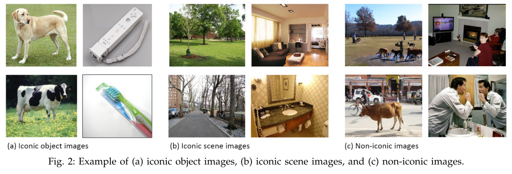
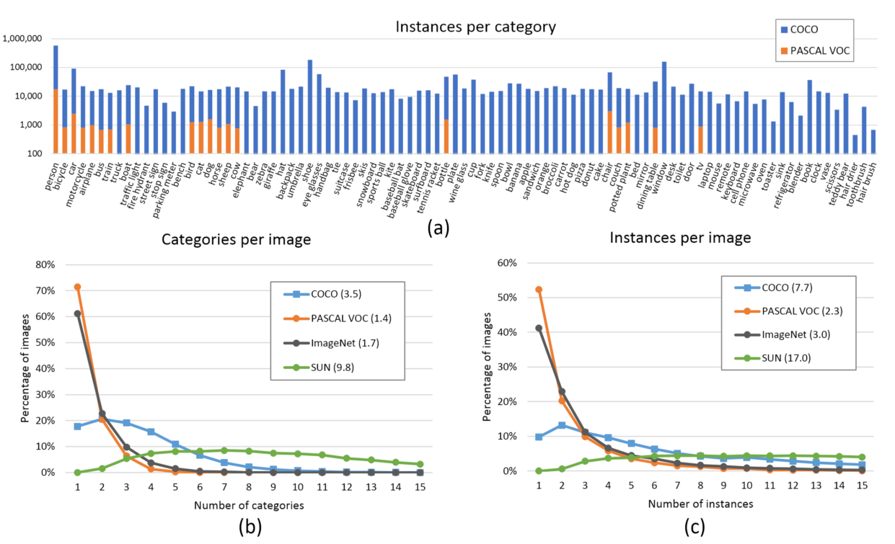
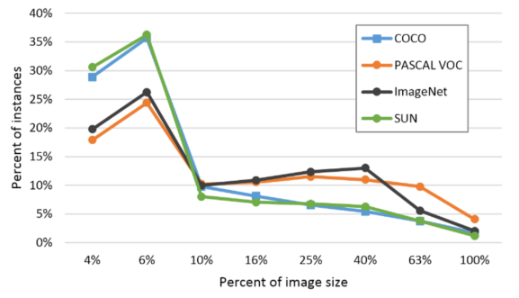
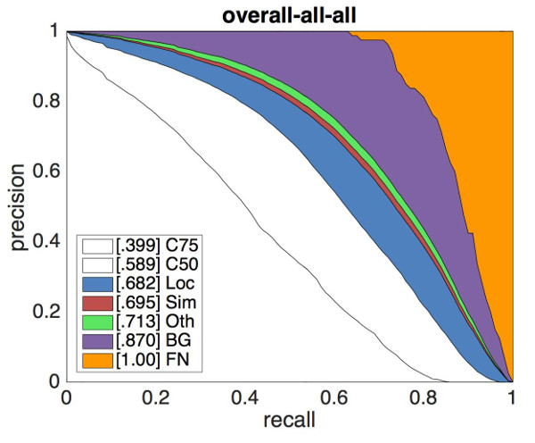
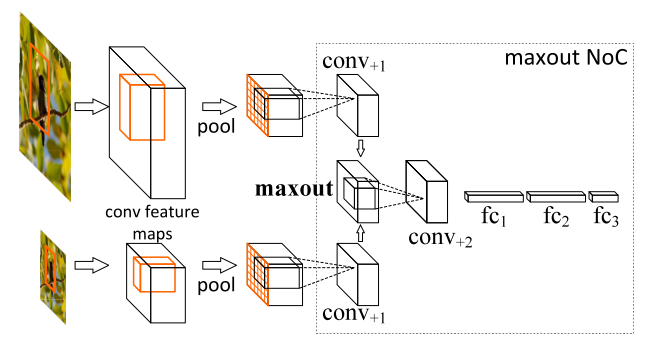
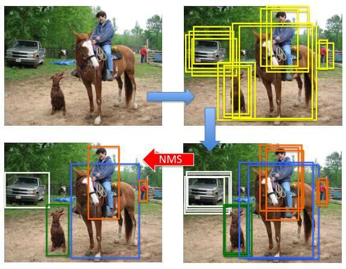

# （二）目标检测模型的评测与训练技巧

## 文章结构

## 检测模型的评测指标

目标检测模型本源上可以用统计推断的框架描述，我们关注其犯第一类错误和第二类错误的概率，通常用准确率和召回率来描述。准确率描述了模型有多准，即在预测为正例的结果中，有多少是真正例；召回率则描述了模型有多全，即在为真的样本中，有多少被我们的模型预测为正例。不同的任务，对两类错误有不同的偏好，常常在某一类错误不多于一定阈值的情况下，努力减少另一类错误。在检测中，mAP（mean Average Precision）作为一个统一的指标将这两种错误兼顾考虑。

具体地，对于每张图片，检测模型输出多个预测框（常常远超真实框的个数），我们使用IoU（Intersection Over Union，交并比）来标记预测框是否为预测正确。标记完成后，随着预测框的增多，召回率总会提升，在不同的召回率水平下对准确率做平均，即得到AP，最后再对所有类别按其所占比例做平均，即得到mAP。

在较早的Pascal VOC数据集上，常采用固定的一个IoU阈值（如0.5, 0.75）来计算mAP，现阶段较为权威的MS COCO数据集上，对不同的IoU阈值（0.5-0.95，0.05为步长）分别计算AP，再综合平均，并且给出了不同大小物体分别的AP表现，对定位准确的模型给予奖励并全面地展现不同大小物体上检测算法的性能，更为科学合理。

在实践中，我们不仅关注检测模型的精度，还关注其运行的速度，常常用FPS（Frame Per Second，每秒帧率）来表示检测模型能够在指定硬件上每秒处理图片的张数。通常来讲，在单块GPU上，两阶段方法的FPS一般在个位数，而单阶段方法可以达到数十。现在检测模型运行的平台并不统一，实践中也不能部署较为昂贵的GPU进行推断。事实上，很多文章并没有严谨讨论其提出模型的速度表现（加了较多的trick以使精度达到SOTA），另外，考虑到目前移动端专用芯片的发展速度和研究进展，速度方面的指标可能较难形成统一的参考标准，需要谨慎看待文章中汇报的测试结果。

## 标准评测数据集

### Pascal VOC（[Pascal Visual Object Classes](http://host.robots.ox.ac.uk/pascal/VOC/)）

自2005年起每年举办一次比赛，最开始只有4类，到2007年扩充为20个类，共有两个常用的版本：2007和2012。学术界常用5k的trainval2007和16k的trainval2012作为训练集（07+12），test2007作为测试集，用10k的trainval2007+test2007和和16k的trainval2012作为训练集（07++12），test2012作为测试集，分别汇报结果。

Pascal VOC对早期检测工作起到了重要的推动作用，目前提升的空间相对有限，权威评测集的交接棒也逐渐传给了下面要介绍的COCO。

### MS COCO（[Common Objects in COntext](http://cocodataset.org)）

 _检测任务在COCO数据集上的进展_

COCO数据集收集了大量包含常见物体的日常场景图片，并提供像素级的实例标注以更精确地评估检测和分割算法的效果，致力于推动场景理解的研究进展。依托这一数据集，每年举办一次比赛，现已涵盖检测、分割、关键点识别、注释等机器视觉的中心任务，是继ImageNet Chanllenge以来最有影响力的学术竞赛之一。

 _iconic与non-iconic图片对比_

相比ImageNet，COCO更加偏好目标与其场景共同出现的图片，即non-iconic images。这样的图片能够反映视觉上的语义，更符合图像理解的任务要求。而相对的iconic images则更适合浅语义的图像分类等任务。

COCO的检测任务共含有80个类，在2014年发布的数据规模分train/val/test分别为80k/40k/40k，学术界较为通用的划分是使用train和35k的val子集作为训练集（trainval35k），使用剩余的val作为测试集（minival），同时向官方的evaluation server提交结果（test-dev）。除此之外，COCO官方也保留一部分test数据作为比赛的评测集。

 _COCO数据集分布_

在分布方面，COCO的每个类含有更多实例，分布也较为均衡（上图a），每张图片包含更多类和更多的实例（上图b和c，均为直方图，每张图片平均分别含3.3个类和7.7个实例），相比Pascal VOC，COCO还含有更多的小物体（下图，横轴是物体占图片的比例）。

 _COCO数据集物体大小分布_

如本文第一节所述，COCO提供的评测标准更为精细化，提供的[API](https://github.com/cocodataset/cocoapi)不仅包含了可视化、评测数据的功能，还有对模型的错误来源分析脚本，能够更清晰地展现算法的不足之处。COCO所建立的这些标准也逐渐被学术界认可，成为通用的评测标准。您可以在[这里](http://cocodataset.org/#detections-leaderboard)找到目前检测任务的LeaderBoard。

 _错误来源分解，详见<http://cocodataset.org/#detections-eval>_

### [Cityscapes](https://www.cityscapes-dataset.com/)

 _Cityscapes数据示例_

Cityscapes数据集专注于现代城市道路场景的理解，提供了30个类的像素级标注，是自动驾驶方向较为权威的评测集。

## 检测模型中的Bells and wisthles

本节介绍常见的提升检测模型性能的技巧，它们常作为trick在比赛中应用。其实，这样的名称有失公允，部分工作反映了作者对检测模型有启发意义的观察，有些具有成为检测模型标准组件的潜力（如果在早期的工作中即被应用则可能成为通用做法）。读者将它们都看作学术界对解决这一问题的努力即可。对研究者，诚实地报告所引用的其他工作并添加有说服力的消融实验（ablation expriments）以支撑自己工作的原创性和贡献之处，则是值得倡导的行为。

### Data augmentation 数据增强

数据增强是增加深度模型鲁棒性和泛化性能的常用手段，随机翻转、随机裁剪、添加噪声等也被引入到检测任务的训练中来，其信念是通过数据的一般性来迫使模型学习到诸如对称不变性、旋转不变性等更一般的表示。通常需要注意标注的相应变换，并且会大幅增加训练的时间。个人认为数据（监督信息）的适时传入可能是更有潜力的方向。

### Multi-scale Training/Testing 多尺度训练/测试

输入图片的尺寸对检测模型的性能影响相当明显，事实上，多尺度是提升精度最明显的技巧之一。在基础网络部分常常会生成比原图小数十倍的特征图，导致小物体的特征描述不容易被检测网络捕捉。通过输入更大、更多尺寸的图片进行训练，能够在一定程度上提高检测模型对物体大小的鲁棒性，仅在测试阶段引入多尺度，也可享受大尺寸和多尺寸带来的增益。

multi-scale training/testing最早见于[1]，训练时，预先定义几个固定的尺度，每个epoch随机选择一个尺度进行训练。测试时，生成几个不同尺度的feature map，对每个Region Proposal，在不同的feature map上也有不同的尺度，我们选择最接近某一固定尺寸（即检测头部的输入尺寸）的Region Proposal作为后续的输入。在[2]中，选择单一尺度的方式被Maxout（element-wise max，逐元素取最大）取代：随机选两个相邻尺度，经过Pooling后使用Maxout进行合并，如下图所示。

 _使用Maxout合并feature vector_

近期的工作如FPN等已经尝试在不同尺度的特征图上进行检测，但多尺度训练/测试仍作为一种提升性能的有效技巧被应用在MS COCO等比赛中。

### Global Context 全局语境

这一技巧在ResNet的工作[3]中提出，做法是把整张图片作为一个RoI，对其进行RoI Pooling并将得到的feature vector拼接于每个RoI的feature vector上，作为一种辅助信息传入之后的R-CNN子网络。目前，也有把相邻尺度上的RoI互相作为context共同传入的做法。

### Box Refinement/Voting 预测框微调/投票法

微调法和投票法由工作[4]提出，前者也被称为Iterative Localization。微调法最初是在SS算法得到的Region Proposal基础上用检测头部进行多次迭代得到一系列box，在ResNet的工作中，作者将输入R-CNN子网络的Region Proposal和R-CNN子网络得到的预测框共同进行NMS（见下面小节）后处理，最后，把跟NMS筛选所得预测框的IoU超过一定阈值的预测框进行按其分数加权的平均，得到最后的预测结果。投票法可以理解为以顶尖筛选出一流，再用一流的结果进行加权投票决策。

### OHEM 在线难例挖掘

OHEM(Online Hard negative Example Mining，在线难例挖掘)见于[5]。两阶段检测模型中，提出的RoI Proposal在输入R-CNN子网络前，我们有机会对正负样本（背景类和前景类）的比例进行调整。通常，背景类的RoI Proposal个数要远远多于前景类，Fast R-CNN的处理方式是随机对两种样本进行上采样和下采样，以使每一batch的正负样本比例保持在1:3，这一做法缓解了类别比例不均衡的问题，是两阶段方法相比单阶段方法具有优势的地方，也被后来的大多数工作沿用。

 _OHEM图解_

但在OHEM的工作中，作者提出用R-CNN子网络对RoI Proposal预测的分数来决定每个batch选用的样本，这样，输入R-CNN子网络的RoI Proposal总为其表现不好的样本，提高了监督学习的效率。实际操作中，维护两个完全相同的R-CNN子网络，其中一个只进行前向传播来为RoI Proposal的选择提供指导，另一个则为正常的R-CNN，参与损失的计算并更新权重，并且将权重复制到前者以使两个分支权重同步。

OHEM以额外的R-CNN子网络的开销来改善RoI Proposal的质量，更有效地利用数据的监督信息，成为两阶段模型提升性能的常用部件之一。

### Soft NMS 软化非极大抑制

 _NMS后处理图示_

NMS(Non-Maximum Suppression，非极大抑制）是检测模型的标准后处理操作，用于去除重合度（IoU）较高的预测框，只保留预测分数最高的预测框作为检测输出。Soft NMS由[6]提出。在传统的NMS中，跟最高预测分数预测框重合度超出一定阈值的预测框会被直接舍弃，作者认为这样不利于相邻物体的检测。提出的改进方法是根据IoU将预测框的预测分数进行惩罚，最后再按分数过滤。配合Deformable Convnets（将在之后的文章介绍），Soft NMS在MS COCO上取得了当时最佳的表现。算法改进如下：

 _Soft-NMS算法改进_

上图中的f即为软化函数，通常取线性或高斯函数，后者效果稍好一些。当然，在享受这一增益的同时，Soft-NMS也引入了一些超参，对不同的数据集需要试探以确定最佳配置。

### RoIAlign RoI对齐

RoIAlign是Mask R-CNN（[7]）的工作中提出的，针对的问题是RoI在进行Pooling时有不同程度的取整，这影响了实例分割中mask损失的计算。文章采用双线性插值的方法将RoI的表示精细化，并带来了较为明显的性能提升。这一技巧也被后来的一些工作（如light-head R-CNN）沿用。

### 拾遗

除去上面所列的技巧外，还有一些做法也值得注意：

- 更好的先验（YOLOv2）：使用聚类方法统计数据中box标注的大小和长宽比，以更好的设置anchor box的生成配置
- 更好的pre-train模型：检测模型的基础网络通常使用ImageNet（通常是ImageNet-1k）上训练好的模型进行初始化，使用更大的数据集（ImageNet-5k）预训练基础网络对精度的提升亦有帮助
- 超参数的调整：部分工作也发现如NMS中IoU阈值的调整（从0.3到0.5）也有利于精度的提升，但这一方面尚无最佳配置参照

最后，集成（Ensemble）作为通用的手段也被应用在比赛中。

## 总结

本篇文章里，我们介绍了检测模型常用的标准评测数据集和训练模型的技巧，上述内容在溯源和表述方面的不实之处也请读者评论指出。从下一篇开始，我们将介绍检测领域较新的趋势，请持续关注。

## Reference

- [1]: [Spatial Pyramid Pooling in Deep Convolutional Networks for Visual Recognition](https://arxiv.org/abs/1406.4729)
- [2]: [Object Detection Networks on Convolutional Feature Maps](https://arxiv.org/abs/1504.06066)
- [3]: [Deep Residual Learning for Image Classification](https://arxiv.org/abs/1512.03385)
- [4]: [Object Detection via a Multi-region & Semantic Segmentatio-aware CNN Model](https://arxiv.org/abs/1505.01749)
- [5]: [Training Region-based Object Detectors with Online Hard Example Mining](https://arxiv.org/1604.03540)
- [6]: [Improving Object Detection With One Line of Code](https://arxiv.org/abs/1704.04503)
- [7]: [Mask R-CNN](https://arxiv.org/abs/1703.06870)
