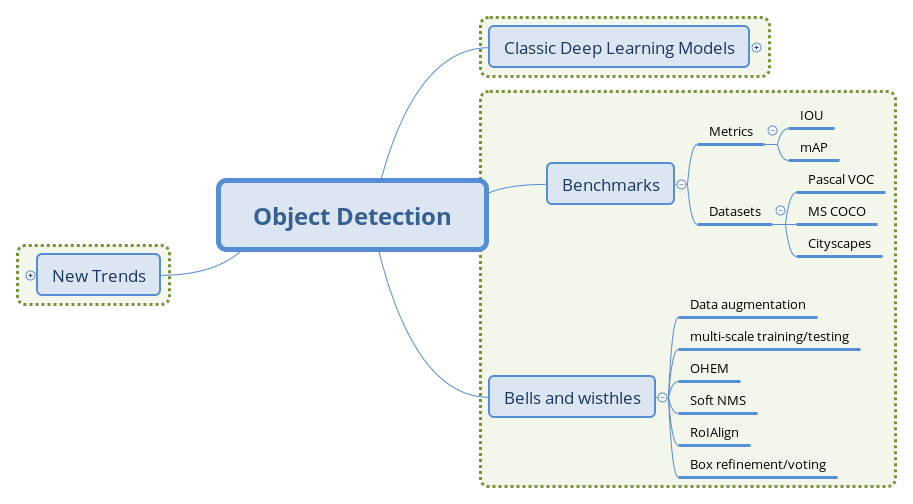
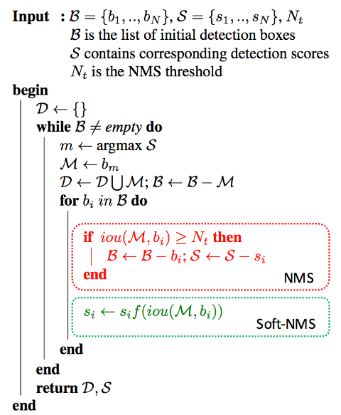

# （二）目标检测模型的评测与训练技巧

## 文章结构

## 检测模型的评测指标

目标检测模型本源上可以用统计推断的框架描述，我们关注其犯第一类错误和第二类错误的概率，通常用准确率和召回率来描述。准确率描述了模型有多准，即在预测为正例的结果中，有多少是真正例；召回率则描述了模型有多全，即在为真的样本中，有多少被我们的模型预测为正例。不同的任务，对两类错误有不同的偏好，常常在某一类错误不多于一定阈值的情况下，努力减少另一类错误。在检测中，mAP（mean Average Precision）作为一个统一的指标将这两种错误兼顾计算。

具体地，对于每张图片，检测模型输出多个预测框（常常远超真实框的个数），我们使用IoU（Intersection Over Union，交并比）来标记预测框是否为预测正确。标记完成后，随着预测框的增多，召回率总会提升，在不同的召回率水平下（通常为0.1, 0.2, ..., 0.9）对准确率做平均，即得到AP，最后再对所有类别按其所占比例做平均，即得到mAP。

在较早的Pascal VOC数据集上，常采用固定的一个IoU阈值（如0.5, 0.7）来计算mAP，现阶段较为权威的MS COCO数据集上，对不同的IoU阈值（0.5-0.95，0.05为步长）分别计算AP，再综合平均，并且给出了不同大小物体分别的AP表现，对定位准确的模型给予奖励并全面地展现不同大小物体上检测算法的性能，更为科学合理。

在实践中，我们不仅关注检测模型的精度，还关注其运行的速度，常常用FPS（Frame Per Second，每秒帧率）来表示检测模型能够在指定硬件上每秒处理图片的张数。通常来讲，在GPU上，两阶段方法的FPS一般在个位数，而单阶段方法可以达到数十。现在检测模型运行的平台并不统一，实践中也不能部署较为昂贵的GPU进行推断。事实上，很多论文也并没有严谨讨论其提出模型的速度表现，因而速度方面的指标并没有统一的参考标准，需要谨慎看待。

## 标准评测数据集

### Pascal VOC（[Pascal Visual Object Classes](http://host.robots.ox.ac.uk/pascal/VOC/)）

自2005年起每年举办一次比赛，最开始只有4类，到2007年扩充为20个类，共9963张图片，2012年的版本包括了08-11年的图片，共11530张，这两年是最为常用的两个版本，是早期检测模型的权威测评集，现阶段模型的入门测评集（类似人脸识别领域的lfw）。目前的mAP表现大多在80以上，Leaderboard在[这里](http://host.robots.ox.ac.uk:8080/leaderboard/displaylb.php?challengeid=11&compid=4)。

### MS COCO（[Common Objects in Context](http://cocodataset.org)）

 _COCO数据集进展_

COCO是目前检测领域最权威的测试基准数据集，自2014年起每年举办一次比赛，检测任务共有80个类。2014年发布的版本train/val/test分别为82,783/40,504/40,775张，学界常取14年版本的train set和部分（35k）val set作为训练集（trainval35k），剩下的5k val set数据作为评测（minival）。除去每年比赛用的保留数据外，官方会发布test-dev数据集作为研究之用，2017年的版本训练集为115k（train2014+val2014-val2017），评测集为5k（val2014的一部分），最后用于比赛的数据有41k。目前最好的结果已经提升到50，Leaderboard在[这里](http://cocodataset.org/#detections-leaderboard)。

相比Pascal VOC，COCO的评测指标更为全面合理，提供的API也更为丰富，推动着机器视觉领域多个方向的研究工作。（more to be added）

### [Cityscapes](https://www.cityscapes-dataset.com/)

 _Cityscapes数据示例_

Cityscapes数据集专注于现代城市道路场景的理解，提供了30个类的像素级标注，是自动驾驶方向较为权威的评测集。

笔者维护了一个检测模型进展追踪项目：[obj_det_progress_tracker](https://github.com/ddlee96/Obj_Det_progress_tracker)，收集了研究论文汇报的在上述评测集上的精度进展，可供参考。

## 检测模型中的Bells and wisthles

本小节介绍常见的提升检测模型性能的技巧，它们常作为trick在比赛中应用，部分技巧也被应用在实践中。

### Data augmentation 数据增强

数据增强是增加深度模型鲁棒性和泛化性能的常用手段，在检测中，常常对图片进行随机水平翻转和随机裁剪等操作来监督模型学习更一般的特征。

### multi-scale training/testing 多尺度训练、测试

输入图片的尺寸对检测模型的性能影响相当明显。在基础网络部分常常会生成比原图小数十倍的特征图，导致小物体的特征描述不容易被检测网络捕捉。通过输入更大、更多尺寸的图片进行训练，能够在一定程度上提高检测模型对物体大小的鲁棒性，仅在测试阶段引入多尺度，也可享受大尺寸和多尺寸带来的增益。近期的工作如FPN等已经尝试在不同尺度的特征图上进行检测，但多尺度训练（测试）仍作为一种提升性能的有效技巧被应用在MS COCO等比赛中。

### OHEM 在线难例挖掘

OHEM(Online Hard negative Example Mining，在线难例挖掘)见于2015年等人的工作。两阶段检测模型中，提出的RoI Proposal在输入R-CNN子网络前，我们有机会对正负样本（背景类和前景类）的比例进行调整。通常，背景类的RoI Proposal个数要远远多于前景类，Fast R-CNN的处理方式是随机对两种样本进行上采样和下采样，以使每一batch的正负样本比例保持在1:3，这一做法缓解了类别比例不均衡的问题，是两阶段方法相比单阶段方法具有优势的地方，也被后来的大多数工作沿用。

 _OHEM图解_

但在OHEM的工作中，作者提出用R-CNN子网络对RoI Proposal预测的分数来决定每个batch选用的样本，这样，输入R-CNN子网络的RoI Proposal总为其表现不好的样本，提高了监督学习的效率。实际操作中，维护两个完全相同的R-CNN子网络，其中一个只进行前向传播来为RoI Proposal的选择提供指导，另一个则为正常的R-CNN，参与损失的计算并更新权重，并且将权重复制到前者以使两个分支权重同步。

OHEM以额外的R-CNN子网络的开销来改善RoI Proposal的质量，更有效地利用数据的监督信息，成为两阶段模型提升性能的常用部件之一。

### Soft NMS 软化非极大抑制

NMS(Non-Maximum Suppression，非极大抑制）是检测模型的标准后处理操作，用于去除重合度（IoU）较高的预测框，只保留预测分数最高的预测框作为检测输出。Soft NMS是等人2017的工作中提出来的。在传统的NMS中，跟最高预测分数预测框重合度超出一定阈值的预测框会被直接舍弃，作者认为这样不利于相邻物体的检测。提出的改进方法是根据IoU将预测框的预测分数进行惩罚，最后再按分数过滤。配合Deformable Convnets，Soft NMS在MS COCO上取得了当时最佳的表现。算法改进如下：

 _Soft-NMS算法改进_

上图中的f即为软化函数，通常取线性或高斯函数，后者效果稍好一些。当然，在享受这一增益的同时，Soft-NMS也引入了一些超参，对不同的数据集需要试探以确定最佳配置。

### RoIAlign RoI对齐

RoIAlign是Kaiming等在Mask R-CNN中提出的，针对的问题是RoI在进行Pooling时有不同程度的取整，这影响了实例分割中mask损失的计算。文章采用双线性插值的方法将RoI的表示精细化，并带来了较为明显的性能提升。这一技巧也被后来的一些工作（如light-head R-CNN）沿用。

TODO:

- [ ] Box Refinement/voting 预测框微调/投票法
