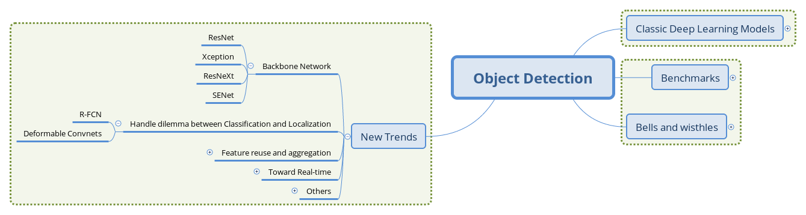
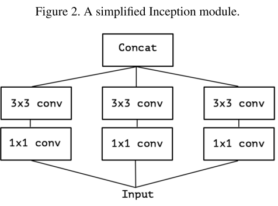
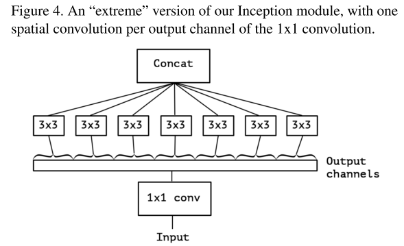
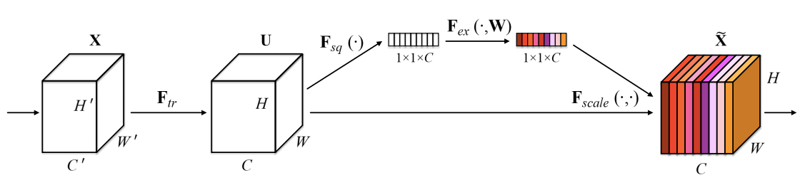
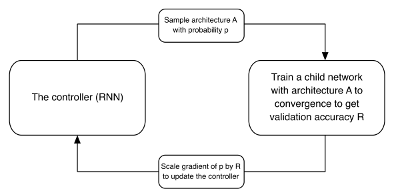
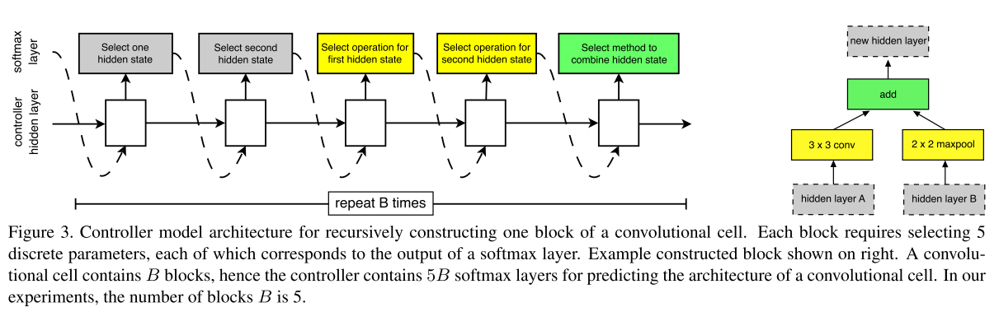
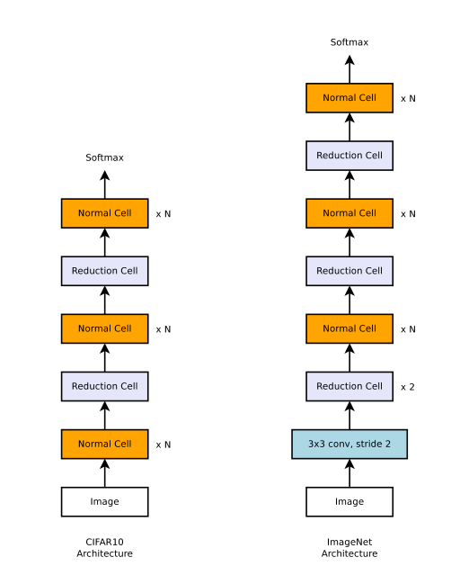
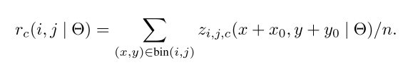
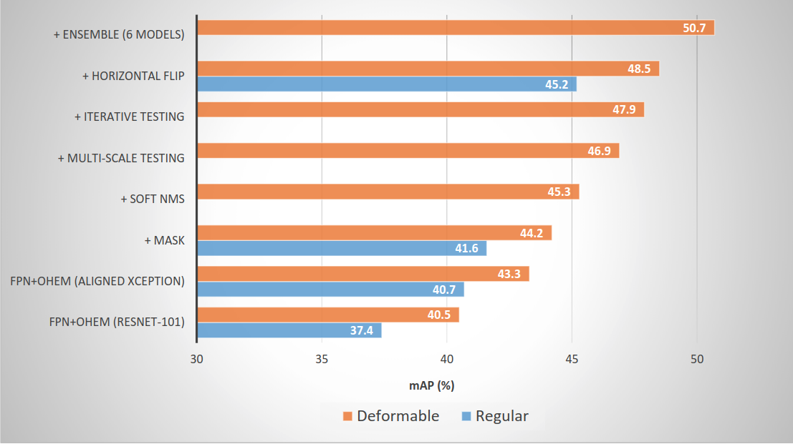

# （三）目标检测新趋势之基础网络结构演进、分类与定位的权衡

从此篇开始，我们对近几年检测领域的工作提供一个概览，并试图从中归纳出一些趋势。由于篇幅和视野所限，文章不会求全，相对注重思路的演进，淡化实验结果的报告。事实上，我们并没有看到这一任务上的"The Best Paper"和"The Final Paper"，现阶段的工作远远没有到解决这一问题的程度，深度学习模型也仍然是非常年轻的研究领域。

实验结果方面，笔者维护了一个检测模型进展追踪项目：[Obj_Det_Progress_Tracker](https://github.com/ddlee96/Obj_Det_progress_tracker)，收集了论文汇报的在VOC和COCO上的精度进展，可供参考。

## 文章结构

本篇关注基础网络架构的演进和处理分类、定位这一矛盾问题上的进展。

## 基础网络结构的演进

基础网络（Backbone network）作为特征提取器，对检测模型的性能有着至关重要的影响。在分类任务的权威评测集ImageNet上，基于卷积网络的方法已经取得超越人类水平的进步，并也促使ImageNet完成了她的历史使命。这也是机器视觉领域的整体进步，优秀的特征、深刻的解释都为其他任务的应用提供了良好的基础。在本节中，我们选取了几个在检测任务上成功应用的基础网络做一些介绍。

### 卷积网络结构演进的趋势

笔者认为，卷积网络已经有如下几个经典的设计范式：

- Repeat. 由AlexNet和VGG等开拓，被之后几乎所有的网络采用。即堆叠相同的拓扑结构，整个网络成为模块化的结构。
- Multi-path. 由Inception系列发扬，将前一层的输入分割到不同的路径上进行变换，最后拼接结果。
- Skip-connection. 最初出现于Highway Network，由ResNet发扬并成为标配。即建立浅层信息与深层信息的传递通道，改变原有的单一线性结构。

以这些范式为脉络整理卷积网络的演进历程，可以归纳出下面的图景：

 _CNN的经典设计范式_

需要说明的是，上图并不能概括完全近年来卷积网络的进步，各分支之间也有很多相互借鉴和共通的特征，而致力于精简网络结构的工作如SqueezeNet等则没有出现。除了上面归纳的三个范式，卷积网络结构方面另一个重要的潮流是深度可分离卷积（Depth-wise seperable convolution）的应用。下面我们选择几个在检测任务上成功应用的基础网络结构进行介绍。

### ResNet: 残差学习

[Deep Residual Learning for Image Recognition](http://arxiv.org/abs/1512.03385)

 _残差单元将原函数分解为残差_

作者将网络的训练解释为对某一复杂函数的拟合，通过添加跳跃连接，变对这一函数的拟合为每层对某一残差的拟合（有点Boosting的意思），引入的恒等项也让BP得到的梯度更为稳定。

残差网络以skip-connection的设计较为成功地缓解了深层网络难以收敛的问题，将网络的深度提高了一个数量级，也带动了一系列对残差网络的解释研究和衍生网络的提出。

在检测领域，VGG作为特征提取器的地位也逐渐被ResNet系列网络替代，文章中以ResNet作为基础网络的Faster R-CNN也常作为后续工作的基线进行比较。

### Xception：可分离卷积的大面积应用

[Xception: Deep Learning with Depthwise Separable Convolutions](https://arxiv.org/abs/1610.02357)

Xception网络可以看做对Inception系列网络的推进，也是深度可分离卷积的成功应用。

文章指出，Inception单元背后的假设是跨Channel和跨空间的相关性可以充分解耦，类似的还有长度和高度方向上的卷积结构（在Inception-v3里的3×3卷积被1×3和3×1卷积替代）。

进一步的，Xception基于更强的假设：跨channel和跨空间的相关性完全解耦。这也是深度可分离卷积所建模的理念。

一个简化的Inception单元：

 _简化的Inception单元，去掉了Pooling分支_

等价于：

 _等价的简化Inception单元，将1x1卷积合并_

将channel的group推向极端，即每个channel都由独立的3×3卷积处理：

 _把分组的粒度降为1_

这样就得到了深度可分离卷积。

Xception最终的网络结构如下，简单讲是线性堆叠的Depthwise Separable卷积，并附加了Skip-connection。

 _Xceptiong的网络结构_

在MS COCO Chanllege 2017中，MSRA团队以对齐版本的Xception为基础网络取得前列的成绩，一定程度上说明了这一网络提取特征的能力；另一方面，Xception的一个改编版本也被Light-head R-CNN的工作（将在下一篇的实时性部分介绍）应用，以两阶段的方式取得了精度和速度都超越SSD等单阶段检测器的表现。

### ResNeXt：新的维度

[Aggregated Residual Transformations for Deep Neural Networks](https://arxiv.org/abs/1611.05431)

本文提出了深度网络的新维度，除了深度、宽度（Channel数）外，作者将在某一层并行transform的路径数提取为第三维度，称为"cardinality"。跟Inception单元不同的是，这些并行路径均共享同一拓扑结构，而非精心设计的卷积核并联。除了并行相同的路径外，也添加了层与层间的shortcut connection。

相比Inception-ResNet，ResNeXt相当于将其Inception Module的每条路径规范化了，并将规范后的路径数目作为新的超参数。

 _ResNeXt的基本单元_

上图中，路径被扩展为多条，而每条路径的宽度（channel数）也变窄了（64->4）。

在近期Facebook开源的Detectron框架中，ResNeXt作为Mask R-CNN的基础网络也取得了非常高的精度。

### SENet：卷积网络的Attention组件

[Squeeze and Excitation Network](https://arxiv.org/abs/1709.01507)

SENet是最后一届ImageNet Challenge的夺冠架构，中心思想是添加旁路为channel之间的相关性进行建模，可以认为是channel维度的attention。

 _Squeeze和Excitation分支_

SENet通过'特征重标定'（Feature Recalibration）来完成channel层面的注意力机制。具体地，先通过Squeeze操作将特征的空间性压缩掉，仅保留channel维度，再通过Excitation操作为每个特征通道生成一个权重，用于显式地建模channel之间的相关性，最后通过Reweight操作将权重加权到原来的channel上，即构成不同channel间重标定。

SENet可以作为网络中模块间的额外连接附属到原有的经典结构上，其Squeeze操作在压缩信息的同时也降低了这一附属连接的开销。

 _SE作为额外部件添加在经典结构上_

经SENet改进的ResNet被UCenter团队应用在MS COCO Chanllenge 2017上，也取得了不错的效果。

### NASNet：网络结构搜索

[Learning Transferable Architectures for Scalable Image Recognition](https://arxiv.org/abs/1707.07012)

NAS（Neural Architecture Searh，神经网络结构搜索）的框架最早出现于作者的另一项工作[Neural Architecture Search with Reinforcement Learning](https://arxiv.org/abs/)，其核心思想是用一个RNN学习定义网络结构的超参，通过强化学习的框架来更新这一RNN来得到更好表现的网络结构。

 _NAS的结构_

在本文中，作者参考本节最初提到的"Repeat"范式，认为在小数据集上搜索到的结构单元具有移植性和扩展性，将这个结构单元通过堆叠得到的大网络能够在较大数据集上取得较好的表现。这就构成了文章的基本思路：将网络搜索局限在微观的局部结构上，以相对原工作较小的开销（实际开销仍然巨大）得到可供扩展的网络单元，再由这些单元作为基本部件填入人工设计的"元结构"。

微观层面，作者仍选择用RNN作为Controller，挑选跳跃连接、最大池化、空洞卷积、深度可分离卷积等等操作构成基本搜索空间，以逐元素相加（element-wise addition）和拼接（concatenation）作为合并操作，并重复一定的构建次数来搜索此基本单元。

 _RNN作为Controller的微观结构搜索，右为示例结构_

宏观层面，将基本单元分为Normal Cell（不改变feature map大小）和Reduction Cell（使feature map的spatial维度减半，即stride=2），交替堆叠一定数量的Normal Cell和Reduction Cell形成下面的元结构。

 _NASNet在不同数据集上的元结构，ImageNet的图片具有更多的像素数，需要更多的Reduction单元_

NASNet采取了自动搜索的方式去设计网络的结构，人工的部分迁移到对搜索空间的构建和评测指标的设立上，是一种"元学习"的策略。应用的检测领域，NASNet作为基础框架的Faster R-CNN取得了SOTA的表现，也支撑了这一搜索得到结构的泛化性能。在最近的工作中，作者团队又设计了ENAS降低搜索的空间和时间开销，继续推动着这一方向的研究。

## 分类与定位问题的权衡

从R-CNN开始，检测模型常采用分类任务上表现最好的卷积网络作为基础网络提取特征，在其基础上添加额外的头部结构来实现检测功能。然而，分类和检测所面向的场景不尽相同：分类常常关注具有整体语义的图像（第二篇中介绍COCO数据集中提到的iconic image），而检测则需要区分前景和背景（non-iconic image）。

分类网络中的Pooling层操作常常会引入平移不变性等使得整体语义的理解更加鲁棒，而在检测任务中我们则需要位置敏感的模型来保证预测位置的精确性，这就产生了分类和定位两个任务间的矛盾。

### R-FCN

[R-FCN: Object Detection via Region-based Fully Convolutinal Networks](https://arxiv.org/abs/1605.06409)

文章指出了检测任务之前的框架存在不自然的设计，即全卷积的特征提取部分+全连接的分类器，而表现最好的图像分类器都是全卷积的结构（ResNet等）。这篇文章提出采用"位置敏感分数图（Position Sensitive Score Map）"的方法来使检测网络保持全卷积结构的同时又拥有位置感知能力。

 _R-FCN中位置敏感分数图_

位置敏感分数图的生成有两个重要操作，一是生成更"厚"的feature map，二是在RoI Pooling时选择性地输入feature map。

Faster R-CNN中，经过RPN得到RoI，转化成分类任务，还加入了一定量的卷积操作（ResNet中的conv5部分），而这一部分卷积操作是不能共享的。R-FCN则着眼于全卷积结构，利用卷积操作在Channel这一维度上的自由性，赋予其位置敏感的意义。下面是具体的操作：

- 在全卷积网络的最后一层，生成k^2(C+1)个Channel的Feature map，其中C为类别数，k^2代表k×k网格，用于分别检测目标物体的k×k个部分。即是用不同channel的feature map代表物体的不同局部（如左上部分，右下部分）。

- 将RPN网络得到的Proposal映射到上一步得到的feature map（厚度为k×k×(C+1)，）后，相应的，将RoI等分为k×k个bin，对第(i,j)个bin，仅考虑对应(i,j)位置的(C+1)个feature map，进行如下计算：其中(x0,y0)是这个RoI的锚点，得到的即是(i,j)号bin对C类别的相应分数。 

- 经过上一步，每个RoI得到的结果是k^2(C+1)大小的分数张量，k×k编码着物体的局部分数信息，进行vote（平均）后得到(C+1)维的分数向量，再接入softmax得到每一类的概率。

上面第二步操作中"仅选取第(i, j)号feature map"是位置信息产生意义的关键。

这样设计的网络结构，所有可学习的参数都分布在可共享的卷积层，因而在训练和测试性能上均有提升。

#### 小结

R-FCN是对Faster R-CNN结构上的改进，部分地解决了位置不变性和位置敏感性的矛盾。通过最大化地共享卷积参数，使得在精度相当的情况下训练和测试效率都有了很大的提升。

### Deformable Convolution Networks

[Deformable Convolution Networks](https://arxiv.org/abs/1703.06211)

本篇文章则提出在卷积和RoI Pooling两个层添加旁路显式学习偏置，来建模物体形状的可变性。这样的设计使得在保持目标全局上位置敏感的同时，对目标局部的建模添加灵活性。

 _可变形卷积的旁支_

 _RoI Pooling的旁支_

如上两图所示，通过在卷积部分添加旁路，显式地用一部分张量表示卷积核在图片不同部分的偏移情况，再添加到原有的卷积操作上，使卷积具有灵活性的特征，提取不同物体的特征时，其形状可变。而在RoI Pooling部分，旁路的添加则赋予采样块可活动的特性，更加灵活地匹配不同物体的形状。

 _可变形卷积和RoIPooling的示例_

在MS COCO Chanllege 2017上，MSRA团队的结果向我们展示了可变形卷积在提升检测模型性能上的有效性：

 _可变形卷积带来的增益_

## 总结

本篇中，我们概述了检测领域基础网络的演进和处理分类定位这一矛盾问题上的进展，基础网络提供更具有语义级区分性的特征，为图像提供更有意义的编码，而分析分类和定位这一对矛盾，则提供给我们对这一任务另一种理解和分治的角度。在下一篇中，我们将关注基础网络提取的特征如何更有效地在检测模型的头部网络得到利用，以及面向实时性检测的一些进展。
