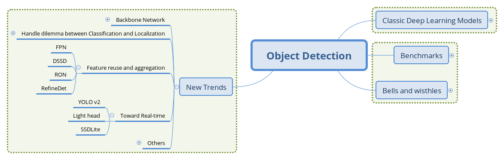
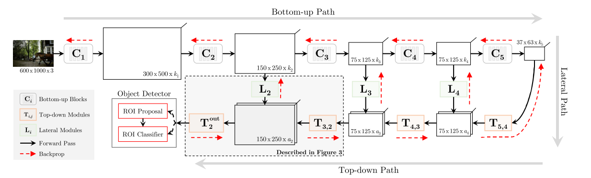
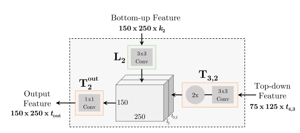
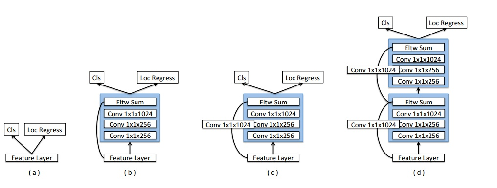
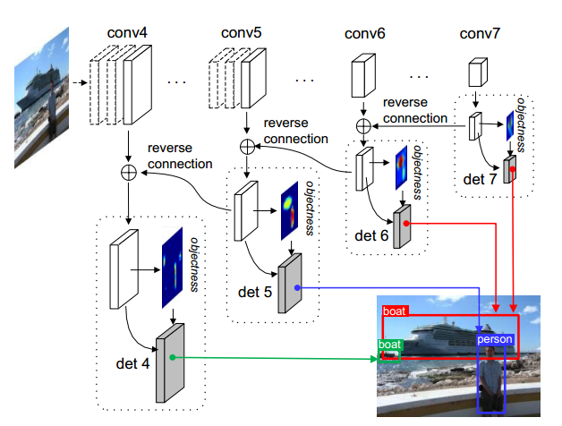
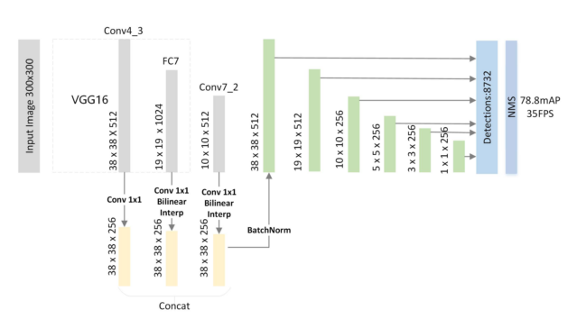
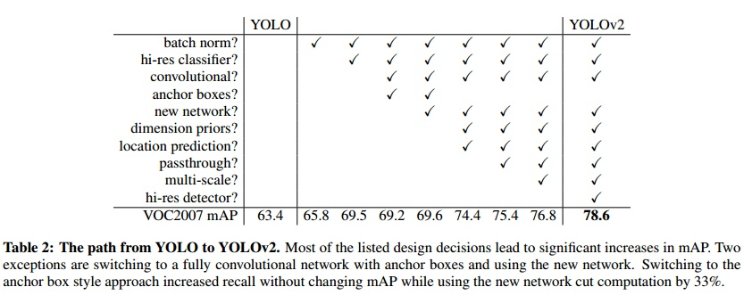

# （四）目标检测领域的新趋势之特征复用、实时性

## 文章结构

本文的第一部分关注检测模型的头部部分。对与每张图片，深度网络其实是通过级联的映射获得了在某一流形上的一个表征，这个表征相比原图片更有计算机视角下的语义性。例如，使用Softmax作为损失函数的分类网络，最后一层获得的张量常常展现出成簇的分布。深度网络因分布式表示带来的指数级增益，拥有远超其他机器学习模型的表示能力，近年来，有不少致力于对深度网络习得特征进行可视化的工作，为研究者提供了部分有直观意义的感知，如浅层学习线条纹理，深层学习物体轮廓。然而，现阶段的深度模型仍然是一个灰盒，缺乏有效的概念去描述网络容量、特征的好坏、表达能力等等被研究者常常提到但又给不出精确定义的指代。本篇的第一节将介绍通过头部网络结构的设计来更有效利用基础网络所提供特征的工作，帮助读者进一步理解检测任务的难点和研究者的解决思路。

第二部分则关注面向实时性检测的工作，这也是检测任务在应用上的目标。如本系列文章第二篇所述，实时性这一要求并没有通用的评价标准，应用领域也涉及到更多网络的压缩、加速和工程上的优化乃至硬件层面的工作等，则不在本文的介绍范围。

## 特征复用与整合

### FPN

[Feature Pyramid Networks for Object Detection](https://arxiv.org/abs/1612.03144)

对图片信息的理解常常关系到对位置和规模上不变性的建模。在较为成功的图片分类模型中，Max-Pooling这一操作建模了位置上的不变性：从局部中挑选最大的响应，这一响应在局部的位置信息就被忽略掉了。而在规模不变性的方向上，添加不同大小感受野的卷积核（VGG），用小卷积核堆叠感受较大的范围（GoogLeNet），自动选择感受野的大小（Inception）等结构也展现了其合理的一面。

回到检测任务，与分类任务不同的是，检测所面临的物体规模问题是跨类别的、处于同一语义场景中的。

一个直观的思路是用不同大小的图片去生成相应大小的feature map，但这样带来巨大的参数，使本来就只能跑个位数图片的显存更加不够用。另一个思路是直接使用不同深度的卷积层生成的feature map，但较浅层的feature map上包含的低等级特征又会干扰分类的精度。

本文提出的方法是在高等级feature map上将特征向下回传，反向构建特征金字塔。

 _FPN结构_

从图片开始，照常进行级联式的特征提取，再添加一条回传路径：从最高级的feature map开始，向下进行最近邻上采样得到与低等级的feature map相同大小的回传feature map，再进行逐元素相加（lateral connection），构成这一深度上的特征。

这种操作的信念是，低等级的feature map包含更多的位置信息，高等级的feature map则包含更好的分类信息，将这两者结合，力图达到检测任务的位置分类双要求。

特征金字塔本是很自然的想法，但如何构建金字塔同时平衡检测任务的定位和分类双目标，又能保证显存的有效利用，是本文做的比较好的地方。如今，FPN也几乎成为特征提取网络的标配，更说明了这种组合方式的有效性。

### TDM

[Beyond Skip Connections: Top-down Modulation for Object Detection](https://arxiv.org/abs/1612.06851)

本文跟FPN是同一时期的工作，其结构也较为相似。作者认为低层级特征对小物体的检测至关重要，但对低层级特征的选择要依靠高层及特征提供的context信息，于是设计TDM（Top-Down Modulation）结构来将这两种信息结合起来处理。

 _TDM整体结构_

可以看到，TDM的结构跟FPN相当类似，但也有如下显著的不同：

- T模块和L模块都是可供替换的子网络单元，可以是Residual或者Inception单元，而在FPN中，二者分别是最近邻上采样（Neareast UpSample）和逐元素相加（Element-wise Addition）。
- FPN在每个层级得到的feature map都进行RoI Proposal和RoI Pooling，而TDM只在自上而下传播后的最大feature map上接入检测头部。

 _TDM中的T模块和L模块_

TDM的设计相比FPN拥有更多可学习的参数和灵活性，文章的实验显示，TDM结构对小物体检测精度的提升帮助明显。而且，TDM是对检测头部的改进，也有推广到单阶段模型的潜力。

### DSSD

[Deconvolutional Single Shot Multibox Detector](https://arxiv.org/abs/1701.06659)

本文是利用反卷积操作对SSD的改进。

 _DSSD的网络结构_

在原版SSD中，检测头部不仅从基础网络提取特征，还添加了额外的卷积层，而本文则在这些额外卷积层后再添加可学习的反卷积层，并将feature map的尺度扩展为原有尺寸，把两个方向上具有相同尺度的feature map叠加后再进行检测，这种设计使检测头部同时利用不同尺度上的低级特征和高级特征。跟FPN不同的是，反传的特征通过反卷积得到而非简单的最近邻上采样。

同时，在反卷积部分添加了额外的卷积层提供"缓冲"，以免反卷积分支影响网络整体的收敛性。另外，文章也通过加入跳跃连接改进了检测头部，使得头部结构相比原版SSD更加复杂。

 _DSSD的头部结构_

### RON

[RON: Reverse Connection with Objectness Prior Networksfor Object Detection](https://arxiv.org/abs/1707.01691)

 _RON结构_

文章关注两个问题：1)多尺度目标检测，2）正负样本比例失衡的问题。

对于前者，文章将相邻的feature map通过reverse connection相连，并在每个feature map上都进行检测，最后再整合过滤。对于后者，类似RPN，对每个anchor box生成一个Objectness priori，作为一个指标来过滤过多的box（但不对box进行调整，RPN对box进行调整，作者指出这会造成重复计算）。文章的实验显示RON在较低的分辨率下取得了超过SSD的表现。

### FSSD

[FSSD: Feature Fusion Single Shot Multibox Detector](https://arxiv.org/abs/1712.00960)

FSSD提出了另一种对不同层级特征进行融合的方式，从基础网络不同层级得到feature map后，利用采样操作将它们在spatial方向上规整化，再拼接到一起，并通过BN层以使不同层级特征的激活值数量级一致。最后，拼接后的feature map经过一系列的卷积操作，产生不同大小的融合feature map传入检测头部的预测网络。

 _FSSD的特征融合方式_

文章指出，特征融合的初衷还是同时利用高层级feature map提供的语义信息和低层级feature map的位置信息，而像FPN中的逐元素相加操作进行融合的方式要求不同层级的feature map具有完全一致的大小，本文则采用拼接的方式，不受channel数的限制。

### RefineDet

[Single-Shot Refinement Neural Network for Object Detection](https://arxiv.org/abs/1711.06897)

 _RefineDet的ARM和ODM_

本文是单阶段的模型，但思路上却是两阶段的。文章指出两阶段方法精度有优势的原因有三点：1）两阶段的设计使之有空间来用采样策略处理类别不均衡的问题；2）级联的方式进行box回归；3）两阶段的特征描述。

文章提出两个模块来在一阶段检测器中引入两阶段设计的优势：Anchor Refinement Module(ARM)和Object Detection Module(ODM)。前者用于识别并过滤背景类anchor来降低分类器的负担，并且调整anchor位置以更好的向分类器输入，后者用于多分类和box的进一步回归。

Single-shot的体现在上面两个模块通过Transfer Connection Block共用特征。除此之外，Transfer Connection Block还将特征图反传，构成类似FPN的效果。两个模块建立联合的损失使网络能够端到端训练。

实验结果显示RefineNet的效果还是不错的，速度跟YOLOv2相当，精度上更有优势。之后的Ablation experiments也分别支撑了负样本过滤、级联box回归和Transfer Connection Block的作用。可以说这篇文章的工作让两阶段和一阶段检测器的界限更加模糊了。

## 面向实时性的工作

### Light Head R-CNN

[Light-Head R-CNN: In Defense of Two-Stage Object Detector](https://arxiv.org/abs/1711.07264)

文章指出两阶段检测器通常在生成Proposal后进行分类的"头"(head)部分进行密集的计算，如ResNet为基础网络的Faster-RCNN将整个stage5（或两个FC）放在RCNN部分， R-FCN要生成一个具有随类别数线性增长的channel数的Score map，这些密集计算正是两阶段方法在精度上领先而在推断速度上难以满足实时要求的原因。

针对这两种元结构(Faster-RCNN和RFCN)，文章提出了"头"轻量化方法，试图在保持精度的同时又能减少冗余的计算量，从而实现精度和速度的Trade-off。

 _Light-head R-CNN与Faster R-CNN, R-FCN的对比_

如上图，虚线框出的部分是三种结构的R-CNN子网络（在每个RoI上进行的计算），light-head R-CNN中，在生成Score map前，ResNet的stage5中卷积被替换为深度可分离卷积，产生的Score map也减少至10×p×p（相比原先的类别数×p×p，p为网格划分粒度，R-FCN中取7）。

一个可能的解释是，"瘦"（channel数较少）的score map使用于分类的特征信息更加紧凑，原先较"厚"的score map在经过PSROIPooling的操作时，大部分信息并没有提取（只提取了特定类和特定位置的信息，与这一信息处在同一score map上的其他数据都被忽略了）。

进一步地，位置敏感的思路将位置性在channel上表达出来，同时隐含地使用了更类别数相同长度的向量表达了分类性（这一长度相同带来的好处即是RCNN子网络可以免去参数）。

light-head在这里的改进则是把这一个隐藏的嵌入空间压缩到较小的值，而在RCNN子网络中加入FC层再使这个空间扩展到类别数的规模，相当于是把计算量分担到了RCNN子网络中。

粗看来，light-head将原来RFCN的score map的职责两步化了：thin score map主攻位置信息，RCNN子网络中的FC主攻分类信息。另外，global average pool的操作被去掉，用于保持精度。

### YOLOv2

[YOLO9000: Better, Faster, Stronger](https://arxiv.org/1612.08242)

单阶段检测模型的先驱工作YOLO也迎来了全面的更新：

1. 在卷积层添加BN，舍弃Dropout
2. 更大尺寸的输入
3. 使用Anchor Boxes，并在头部运用卷积替代全连接层
4. 使用聚类方法得到更好的先验，用于生成Anchor Boxes
5. 参考Fast R-CNN的方法对位置坐标进行log/exp变换使坐标回归的损失保持在合适的数量级
6. passthrough层：类似ResNet的skip-connection，将不同尺寸的feature map拼接到一起
7. 多尺度训练
8. 更高效的网络Darknet-19，类似VGG的网络，在ImageNet上以较少的参数量达到跟当前最佳相当的精度

 _YOLOv2的改进_

此次改进后，YOLOv2吸收了很多工作的优点，达到跟SSD相当的精度和更快的推断速度。

### SSDLite(MobileNets V2)

SSDLite是在介绍MobileNets V2的论文[Inverted Residuals and Linear Bottlenecks: Mobile Networks for Classification, Detection and Segmentation](https://arxiv.org/abs/1801.04381)中提出的。

MobileNets是一系列大面积应用深度可分离卷积的网络结构，试图以较小的参数量来达到跟大型网络相当的精度，以便能够在移动端部署。在本文中，作者提出了对MobileNets的改进版本，通过移动跳跃连接的位置并去掉某些ReLU层来实现更好的参数利用。可参考这个[问题](https://www.zhihu.com/question/265709710)了解更多关于这一改进的解释。

在检测方面，SSDLite的改进之处在于将SSD的检测头部中的卷积运算替换为深度可分离卷积，降低了头部计算的参数量。另外，这项工作首次给出了检测模型在移动设备CPU上单核运行的速度，提供了现在移动终端执行类似任务性能的一个参考。

## 总结

从基础网络的不同层级提取习得的feature map并通过一定的连接将它们整合，是近年来检测模型的重要趋势，这其实也跟卷积网络整体的发展趋势相合。另一方面，面向实时性的改进则继续推动着检测任务在应用领域的发展。

笔者视野有限，对这些工作的介绍中不实和不当之处请读者指出，有遗漏的重要工作也请评论交流。在下一篇中，我们将对检测领域的其他思路的工作做一个概览，并给整个系列文章作结。
